<!--# Owen · `reshir0m`-->

Washington-based, studying at Clover Park Technical College. I build things I
want to exist, then spend longer keeping them running than I spent building them.

### A Little About Me 
- Yes both of my rigs are named after Keyblades from Kingdom Hearts.
- I like anime, manga, and video games.
- Spider-Man is my favorite superhero.
- I've been working with computers since I was 7 years old.
- I love space!

### Main Rig
| Host | Role | Specs |
|--- | --- | --- |
| `oblivion` | Daily driver — Fedora 44, KDE Plasma | i9-12900K · Nvidia Geforce RTX 3080 · 32GB Corsair Dominator Platinum |

### Homelab
| Host | Role | Specs |
|--- | --- | --- |
| `oathkeeper` | Proxmox hypervisor — services and NAS storage | Ryzen 7 2700X · Nvidia Geforce GTX 1050 Ti · 32GB Corsair Vengeance · 500GB SSD OS Drive · 3x 1 TB HDD |
- Game servers in Docker — Minecraft (vanilla)
- TrueNAS virtual machine on the bulk drives: pools named after stars starting with `vega`
- Tailscale for remote access
- Compose stacks live in `~/servers`
